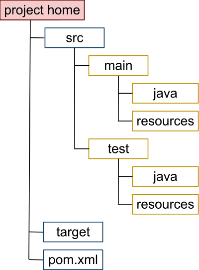

## Configuration
Configuration is the manner in which components(variables, classes, interfaces, templates etc.) are arranged to make up the application.

## Convention
Coding conventions are a set of guidelines for a specific programming language that recommend programming style, practices,
and methods for each aspect of a program written in that language.

## Convention over Configuration
Convention over configuration is a software development approach geared toward developing programs according to typical programming conventions, 
versus programmer defined configurations. It enables quick and simple software creation while maintaining base software requirements.

Convention over configuration is also known as coding by convention.

Convention over configuration relies on the development of a program through the use of an underlying language’s native procedures, functions, classes and variables. 
This approach reduces or eliminates the need for additional software configuration files, ultimately facilitating and expediting software development, 
code consistency and maintenance. However, to follow these conventions, a software developer must be acquainted with the underlying framework. 

### Definition
Convention over configuration (also known as coding by convention) is a software design paradigm used by software frameworks that
attempts to decrease the number of decisions that a developer using the framework is required to make without necessarily
losing flexibility and Don't repeat yourself (DRY) principles.

**Example**: The phrase essentially means a developer only needs to specify unconventional aspects of the application. 
For example, if there is a class Sales in the model, the corresponding table in the database is called "sales" by default. 
It is only if one deviates from this convention, such as the table "product sales", that one needs to write code regarding these names. 

### Motivation
Some frameworks need multiple configuration files, each with many settings. These provide information specific to each project,
ranging from URLs to mappings between classes and database tables. Many configuration files with many parameters are often difficult to maintain. 

### Usage
Many modern frameworks use a convention over configuration approach.
The concept is older, however, dating back to the concept of a default, and can be spotted more recently in the roots of Java libraries.
For example, the JavaBeans specification relies on it heavily. To quote the JavaBeans specification.

The Maven software tool auto-generated this directory structure for a Java project.

### Benefit
- Benefit of convention over configuration paradigm in web development the productivity since you won't be required to
configured to set all the rules and there are **less decision that a programmer has to make**.

### Disadvantage
- Disadvantages of the convention over configuration approach can occur due to conflicts with other software design principles, 
  like the **Zen of Python**'s "explicit is better than implicit." 
