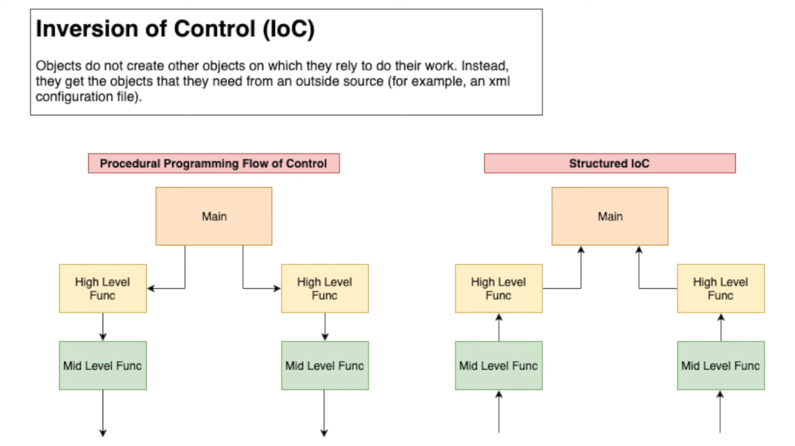

## Dependency Injection
- It is a design technique that allows us to inject dependencies into our code.
- It is a way to decouple the code from the way it is implemented.
- It removes the dependency from the programming code so that it can be easy to manage and test the application.
- It makes our programming code loosely coupled.


Dependency injection is a way to create your dependencies outside of the class that uses it.  
You inject them from the outside, and take control about their creation away from the inside of your class.  
This is also why dependency injection is a realization of the Inversion of control (IoC) principle.

## Dependency Inversion Principle
- High-level modules should not import anything from low-level modules. Both should depend on abstractions (e.g., interfaces).
- Abstractions should not depend on details. Details (concrete implementations) should depend on abstractions.

## Inversion of Control
- It means to create instance of the dependencies first and latter instance of the class, instead of 
  creating an instance of the class first and then creating instance of the dependencies.
- It inverts the flow of control of the program execution.
- Instead of **callee** controlling the flow of control (while creating dependencies) of the program execution,
  **caller** controls the flow of control.


### Purpose of IOC
- To decouple the execution of a task from implementation.
- To focus a module on the task it is designed for.
- To free modules from assumptions about how other systems do what they do and instead rely on contracts.
- To prevent side effects when replacing a module.

Inversion of control is sometimes humorously referred to as the "***Hollywood Principle: Don't call us, we'll call you***". 



### Spring IOC Container
- An IoC container is a common characteristic of frameworks that implement IoC. 
- In the Spring framework, the interface ApplicationContext represents the IoC container. 
- The Spring container is responsible for instantiating, configuring and assembling objects known as beans, as well as managing their life cycles

- The Spring framework provides several implementations of the ApplicationContext interface: `ClassPathXmlApplicationContext` and `FileSystemXmlApplicationContext` for standalone applications, and `WebApplicationContext` for web applications.

- In order to assemble beans, the container uses configuration metadata, which can be in the form of XML configuration or annotations.
    Here's one way to manually instantiate a container:

    ```java
    ApplicationContext context = new ClassPathXmlApplicationContext("applicationContext.xml");
    ```

    To set the item attribute in the example above, we can use metadata. Then the container will read this metadata and use it to assemble beans at runtime.
    Dependency Injection in Spring can be done through constructors, setters or fields.


