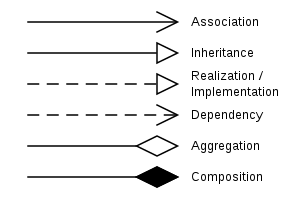
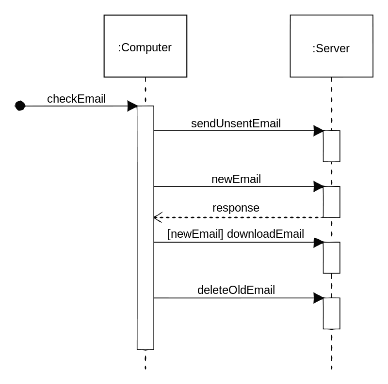

UML (Unified Modeling Language) is a standard language for specifying, visualizing, constructing, and documenting the artifacts of software systems.

- UML stands for Unified Modeling Language.
- UML is different from the other common programming languages such as C++, Java, COBOL, etc.
- UML is a pictorial language used to make software blueprints.
- UML can be described as a general purpose visual modeling language to visualize, specify, construct, and document software system.
- Although UML is generally used to model software systems, it is not limited within this boundary. It is also used to model non-software systems as well. For example, the process flow in a manufacturing unit, etc.

## UML Building Blocks
- Things
- Relationships
- Diagrams

### Things
- Structural - static part, eg: class, interface, package, etc.
- Behavioral - dynamic part, eg: interaction, state machine, etc.
- Grouping - mechanism to group things together, eg: package, etc.
- Annotational - mechanism to capture remarks, description and comments. show how the elements are associated with each other.

### Relationships
1. Dependency  - relationship between two things in which change in one element also affects the other element.
2. Association - set of links that conects the elements of a UML model. It also describes how many objects are taking part in that relationship.
3. Generalization - relationship that describes inheritance relationship in the world of objects.
4. Realization - relationship that describes the implementation of an interface in a class.

### Diagrams
- Class diagram
- Object diagram
- Use case diagram
- Sequence diagram
- Collaboration diagram
- Activity diagram
- Statechart diagram
- Deployment diagram
- Component diagram

#### Examples
##### Class Diagram

##### Object Diagram

##### Use Case Diagram

##### Sequence Diagram

