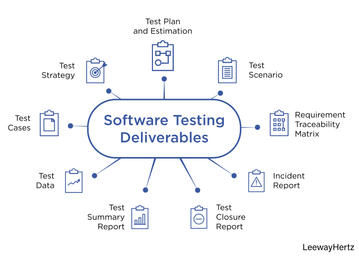

Proces of evaluating a software system by manual or automated means to verify that it satisfies the specified requirements.

## Why ?
1. To find errors.
2. To ensure that software delivered does not have defects.
3. Post removal of bugs is expensive.
4. Buggy software can be harmful to data, property and life.
5. To improve quality, thus having good business and trust.
6. To ensure all the product functionalities work as per the specification.

## How ?

### On basis of Resource Involved
1. Manual testing
2. Automated testing

### On basis of Orientation
1. Demonstration Oriented Testing - Optimistic / Positive Approach
2. Destruction Oriented Testing - Pessimistic / Negative Approach
3. Debugging Oriented Testing - Debugging Approach

## Levels of Software Testing
1. Unit Testing
2. Component Testing
3. Integration Testing
4. System Testing
5. Acceptance Testing

## When ?
- Until `BUDGET`, `TIME` and `QUALITY` are satisfied.

## Principles - `[PATTEED]`
1. Testing Shows Presence of Bugs
    - Shows presence
    - Cannot prove absence
    - Helps to find undiscovered defects.
2. Exhaustive Testing is impossible
    - Impossible to test all possible input combinations.
    - Smarter way should be adopted.
3. Early Testing
    - Start as soon as possible.
    - finding defects early saves a lot of money than finding it later.
4. Defect Clustering
    - Equal distribution of bugs across the module is not possible.
    - Defect may be clustered in small piece of code/module.
5. Pesticide Paradox
    - Executing same tests again and again will not help to identify more bugs.
    - Review them regularly and modify if changes required.
6. Absence of Error Fallacy
    - Finding and fixing many bugs doesn't help.
    - If if doesn't meed users requirement, it is not useful.
7. Testing is Context Dependent
    - Different software are tested in different contexts.
    - Eg: Testing in a browser, testing in a server, testing in a mobile app.
    - Eg: Testing for a banking software is different from testing for a web application.

## Verification and Validation

| Verification                                                                           | Validation                                                                                      |
| -------------------------------------------------------------------------------------- | ----------------------------------------------------------------------------------------------- |
| It includes checking documents, design, codes and programs.                            | It includes testing and validating the actual product.                                          |
| Verification is the static testing.                                                    | Validation is the dynamic testing.                                                              |
| It does not include the execution of the code.                                         | It includes the execution of the code.                                                          |
| Methods used in verification are reviews, walk-through, inspections and desk-checking. | Methods used in validation are Black Box Testing, White Box Testing and non-functional testing. |
| It checks whether the software conforms to specifications or not.                      | It checks whether the software meets the requirements and expectations of a customer or not.    |
| It can find the bugs in the early stage of the development.                            | It can only find the bugs that could not be found by the verification process.                  |
| The goal of verification is application and software architecture and specification.   | The goal of validation is an actual product.                                                    |
| Quality assurance team does verification.                                              | Validation is executed on software code with the help of testing team.                          |
| It comes before validation.                                                            | It comes after verification.                                                                    |
| It consists of checking of documents/files and is performed by human.                  | It consists of execution of program and is performed by computer.                               |
|                                                                                        |                                                                                                 |

## Test Cases

- A test case is a set of actions performed on a system to determine if it satisfies software requirements and functions correctly. 
- The purpose of a test case is to determine if different features within a system are performing as expected and to confirm that the system satisfies all related standards, guidelines and customer requirements. 
- The process of writing a test case can also help reveal errors or defects within the system.
- Test cases are typically written by members of the quality assurance (QA) team or the testing team and can be used as step-by-step instructions for each system test. 
- Testing begins once the development team has finished a system feature or set of features. 
- A sequence or collection of test cases is called a **test suite**.

### Benefits
- Guaranteed good test coverage.
- Reduced maintenance and software support costs.
- Reusable test cases.
- Confirmation that the software satisfies end-user requirements.
- Improved quality of software and user experience.
- Higher quality products lead to more satisfied customers.
- More satisfied customers will increase company profits.

### Example

#### Book Issue
| SN | Test Cases | Expected Result | Test Result |
|---|---|---|---|
| | On Click of | | |
| 1. | Add Button | At first, user have to fill all fields with valid data, if the accession number book is already issued, then it will give proper message. | Successful |
| 2. | Delete button Button | This deletes the details of the book by using Register No. | Successful |
| 3. | Update Button | Modified records are updated in database. | Successful |
| 4. | Search Button | Displays the details of issued book. Otherwise give proper error message. | Successful |
| 5. | Clear Button | Clear all fields. | Successful |
| 6. | Exit Button | Exit from the application. | Successful |
| 7. | Print Button | Print the details of issued book. | Successful |
| 8. | Next Button | Next page is displayed. | Successful |

#### Book Return
| SN | Test Cases | Expected Result | Test Result |
|---|---|---|---|
| | On Click of | | |
| 1. | Add Button | At first, user have to fill all fields with valid data, if any error like entering text data instead of number or entering number instead of text is found, then it gives proper message, otherwise adds Return Record to the database. | Successful |
| 2. | Delete button Button | This deletes the details of the book by using Register No. | Successful |
| 3. | Update Button | Modified records are updated in database. | Successful |
| 4. | Search Button | Displays the details of issued book. Otherwise give proper error message. | Successful |
| 5. | Clear Button | Clear all fields. | Successful |
| 6. | Exit Button | Exit from the application. | Successful |
| 7. | Print Button | Print the details of returned book. | Successful |
| 8. | Next Button | Next page is displayed. | Successful |

## Types of Testing
| Black Box Testing                                                                                                                                            | White Box Testing                                                                                                                                              | Grey Box Testing                                                                                                                       |
| ------------------------------------------------------------------------------------------------------------------------------------------------------------ | -------------------------------------------------------------------------------------------------------------------------------------------------------------- | -------------------------------------------------------------------------------------------------------------------------------------- |
| Knowledge of internal working structure (Code) is not required for this type of testing. Only GUI (Graphical User Interface) is required for test cases.     | Knowledge of internal working structure (Coding of software) is necessarily required for this type of testing.                                                 | Partially Knowledge of the internal working structure is required.                                                                     |
| Black Box Testing is also known as functional testing, data-driven testing, and closed box testing.                                                          | White Box Testing is also known as structural testing, clear box testing, code-based testing, and transparent testing.                                         | Grey Box Testing is also known as translucent testing as the tester has limited knowledge of coding.                                   |
| The approach towards testing includes trial techniques and error guessing method because tester does not need knowledge of internal coding of the software.  | White Box Testing is proceeded by verifying the system boundaries and data domains inherent in the software as there is no lack of internal coding knowledge.  | If the tester has knowledge of coding, then it is proceeded by validating data domains and internal system boundaries of the software. |
| The testing space of tables for inputs (inputs to be used for creating test cases) is pretty huge and largest among all testing spaces.                      | The testing space of tables for inputs (inputs to be used for creating test cases) is less as compared to Black Box testing.                                   | The testing space of tables for inputs (inputs to be used for creating test cases) is smaller than Black Box and White Box testing.    |
| It is very difficult to discover hidden errors of the software because errors can be due to internal working which is unknown for Black Box testing.         | It is simple to discover hidden errors because it can be due to internal working which is deeply explored in White Box testing.                                | Difficult to discover the hidden error. Might be found in user level testing.                                                          |
| It is not considered for algorithm testing.                                                                                                                  | It is well suitable and recommended for algorithm testing.                                                                                                     | It is not considered for algorithm testing.                                                                                            |
| Time consumption in Black Box testing depends upon the availability of the functional specifications.                                                        | White Box testing takes a long time to design test cases due to lengthy code.                                                                                  | Test cases designing can be done in a short time period.                                                                               |
| Tester, developer and the end user can be the part of testing.                                                                                               | Only tester and developer can be a part of testing; the end user can not involve.                                                                              | Tester, developer and the end user can be the part of testing.                                                                         |
| It is the least time-consuming process among all the testing processes.                                                                                      | The entire testing process is the most time consuming among all the testing processes.                                                                         | less time consuming than White Box testing.                                                                                            |
| Resilience and security against viral attacks are covered under Black Box testing.                                                                           | Resilience and security against viral attacks are not covered under White Box testing.                                                                         | Resilience and security against viral attacks are not covered under Grey Box testing.                                                  |
| The base of this testing is external expectations internal behavior is unknown.                                                                              | The base of this testing is coding which is responsible for internal working.                                                                                  | Testing based on high-level database diagrams and dataflow diagrams.                                                                   |
| It is less exhaustive than White Box and Grey Box testing methods.                                                                                           | It is most exhaustive between Black Box and Grey Box testing methods.                                                                                          | Partly exhaustive; depends upon the type of test cases are coding based or GUI based.                                                  |
