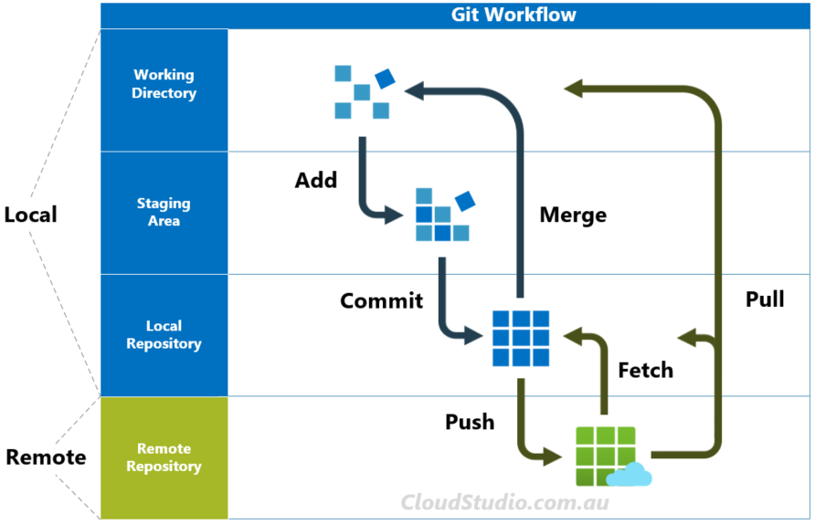

A source code management (`SCM`) isa tool for managing a collection of a program code that provides you with 3 important capabilities.

- Reversibility
- Concurrency
- Annotations

It is synonymously also known as Version Control System (`VCS`).

VCS is the combination of technologies and practices for tracking and controlling process to a project files in particular to source code, documentation, and other related artifacts.

VCS helps with almost all aspects of a project, including:  

- Version control
- Tracking changes to the source code
- Inter Developer Communication
- Release Management
- Bug Management

## Benefits
1. Complete version history
2. More effective collaboration
3. Workflow automation
4. Better communication
5. Graphic displays of code history
6. Generate release notes
7. Code Backup

## Types of VCS
1. Centralized Version Control System
2. Distributed Version Control System

### Centralized Version Control System

#### Benefits
1. It is easy to understand and get started.
2. You have more control over users and access ( since it is served from one place ).

#### Drawbacks
1. Dependent on access to the server.
2. Hard to manage a server and backups.
3. It can be slower because every command connects to the server.
4. Branching and merging tools are difficult to use.

### Distributed Version Control System

#### GIT Workflow

#### Benefits
1. Each user has their own copy of the entire repository, not just the files but the history as well  as so it is fast.
2. More powerful and detailed change tracking which means less conflict.
3. No server necessary, all actions except sharing repository, are local (offline commit).
4. Branching and merging is more reliable.

#### Drawbacks
1. The distributed model is harder to understand.

### Difference between Centralized and Distributed VCS

| Factor | Centralized VCS | Distributed VCS |
| |----------------|-----------------|
| **Definition** | It is the form of version control in which the central repository of the server provides the latest code to the client machines. | It is the form of version control where the complete codebase (including its full history) is mirrored on every developer's computer. |
| **Local Repository** | There are no local repositories. | There are local repositories. |
| **Speed** | Works comparatively slower. | Works faster. |
| **Internet Connection** | Always require internet connectivity. | Developers can work with a local repository without an internet connection. |
| **Main Focus** | Focuses on synchronizing, tracking and backing up files. | Focuses on sharing changes. |
| **Failure** | A failure in the central server terminates all the versions. Eg: If the central server is down, all the developers will be unable to access the repository. | A failure in the main server does not affect the development. Eg: If the central server is down, all the developers will be able to access the repository.|
| **Figure** |  |  |
| **Example** | Eg: SVN (Subversion) | Eg: Git |

