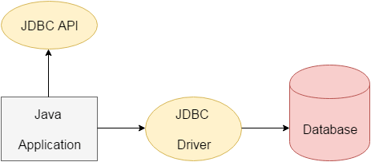

- A SQL Injection is an attack that consist of insertion ot injection of a SQL query via the input data from the client to the applicaiton.
- SQL Injection is the code injection technique where the malicious SQL queries are inserted into an entry field and then executed by the application.

A successful SQL injection expert can easily exploit this vulnerability to gain access to the database. They can:  

- read sensitive data from database, 
- modify database data (insert, update, delete), 
- and even execute arbitrary SQL commands such as administrative operations (such as shut own the DBMS).


## Types of SQL Injection
1. Classic SQL Injection 
      - Error based SQL Injection
          - It relies on error message thrown by the database server to obtain information about the structure of the database.
    - Union based SQL Injection
          - It forces `UNION` SQL operator to combine the results of one or more select statements into a single results which is then returned as a response.

2. Blind SQL Injection
      - Boolean Based
          - It forces the application to return a different result depending on whether the query returns `True` or `False` result.


## Prevention technique

1. Prepared Statement (With parameterized query)
      - Paramaterized query force the developer to first refine all the SQL code and pass each parameter to query later.
      - This coding style allows the database to distinguish between code and data, regardless of what user input is supplied.
      - Prepared Statements ensure that an attacker is not able to change the intent of the query, even if SQL commands are inserted by an attackers.

      - Explaination: Can't be able to change the paramter later.

2. Stored Procedure
      - Stored procedure are not always safe from SQL injection, however it tries to maintain certain standard of security.
      - Stored Procedure programming constructs have the same effect as the use of parameterized queries when incremented safely which is the norm for most stored procedure languages.
  
3. White List Input Valdation
      - Whitelist validation is the practice of only accepting input that is known to be good.  

        This can involve validating compliance with the expected type, length or size, numeric range, or other format
        standards before accepting the input for further processing.

4. Escaping all user supplied input.
      - Escaping all user supplied input is the practice of escaping all user supplied input before passing it to the database.
      - While escaping, the input is converted to a format that is safe for the database to process.
      - The escaped input doesn't perform any operation on the database, even if the input contains malicious SQL commands.


### Steps to Build JDBC Application using Prepared Statement



1. Load and Register driver class.  
```Class.forName("Oracle.jdbc.OracleDriver");```

2. Establish Conection  
```Connection con = Driver.Manager.getConnection( url , DbUsername , DbPassword )  ;```
3.  Creation of statement Object   
    ``` Statement st = con.createStatement(); ```
4. Send and Execute SQL Query  
    ``` Result rs = st.executeQuery("Select * from employees");```
5. Process Result from ResultSet  
       
        while(rs.next())
        {
            System.out.Println(rs.getInt(1));
        }

6. Close connection
    ```con.close();```

### Types of SQL Commands

1. **DDL**(Data Definition Language)  
```CREATE TABLE, ALTER, DROP```
2. **DQL**(Data Query Language)  
```SELECT```
3. **DCL**(Data Control Language)  
```ALTER, PASSWORD, GRANT ACCESS```
4. **DML**(Data Manipulation Language)  
```INSERT, DELETE, UPDATE```
5. (Data Administration)  
```START AUDIT```
6. (Data Transaction)  
```COMMIT, ROLLBACK, SAVEPOINT```

### What should I know as Java Developer ?

##### Select Queries (**DQL**) 
> Returns Result Set

##### Non-Select Queries (**DML**)
> Returns Numeric Value

#### Methods to Execute **SQL** Query
1. ```executeQuery()```
- To execute ```SELECT``` queries.

        public result executeQuery(String sqlQuery) throws SQLException
Eg:

        Result rs = st.executeQuery("SELECT * FROM employess");
        while(rs.next()){
            System.out.println(" ID : " rs.getInt(1));
        }

2. ```executeUpdate()```
- Applicable for non-select operation(DML)
```public int executeUpdate(String sqlQuery) throws SQLException``` 

Eg:

        int affectedRow = st.executeUpdate("INSERT INTO employees(`id`) VALUES ('1')");
Returns the afftected rows.

3. ```execute()```
- For both ```SELECT``` and NON-```SELECT``` operations.
- If you don't know ```SQL``` query until run-time, we can use execute().
- Return type => ```boolean```  
 🚀  True - ```SELECT``` Query  
 🚀  false - Non-```SELECT``` Query  
 ```public boolean execute (String query) throws SQLException```

 Eg:

        boolean b = st.execute(Dynamically provide SQLQuery);
        if(b == true) {
            ResultSet rs = st.getResultSet();
        }
        else
        {
            int rowCount = st.getUpdateCount();
        }


