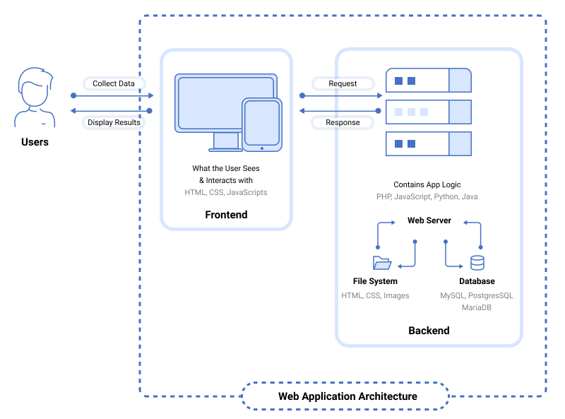

> What is Web Application Architecture?

- Web application architecture is a blueprint of simultaneous interactions between components, databases, middleware systems, user interfaces, and servers in an application.
- It can also be described as the layout that logically defines the connection between the server and client-side for a better web experience.

