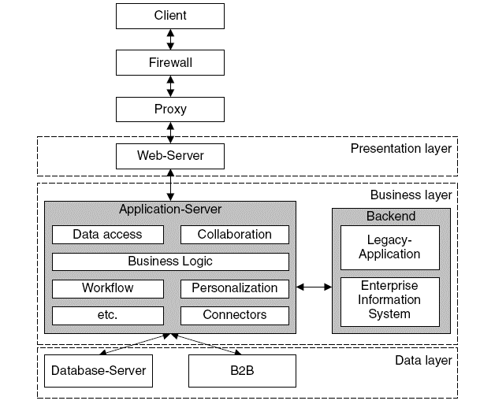

## 3 Tier Architecture
- In 3 tier architecture, there are 3 components: Client PC, An Application server and A Database Server.
- The work of server is distributed among application server and database server.
- Application server has the required communication functions.
- The data required by the business logic exists in database server.
- The required data is returned to public servers and then to client PC.

### Advantages:

- Improved Data Integrity
- High Degree of Flexibility in deployment platform and configurations
- Improved security
- High Performance and persistent objects
- Architecture is scalable, adding users and resources in future would be easy
- Maintenance and modifications can be done effectively
- Code and data reusability can be achieved

### Disadvantages:

- 3 tier architecture is complex compared to 1 tier and 2 tier
- Cost of network maintenance and deployment is greater than 1 tier and 2 tier

The layers of web application are :
1. Presentation Layer.
2. Data Source Layer
3. Domain Logic & Business Logic Layer

### Presentation Layer
- The presentation layer is the layer that handles the user interface.
- It is the layer that handles the user interaction with the application.
- The presentation layer provides necessary data to the client’s side. 
- It receives input data, processes users’ requests, sends them to data services and puts results to the browser.
- **With Java EE, It is handled with JSP, JS, HTML and CSS.**

### Data Source Layer
- The data source layer is the layer that handles the data services.
- This is where the data arrives at your organization.
- Information is stored and received from a database or file system.
- The information is passed back to the logic tier for processing, and then eventually back to the user.
- **With Java EE, It is handled with JDBC, Hibernate, JPA.**

### Domain Logic & Business Logic Layer
- The domain logic layer is the layer that handles the business logic.
- It uses an application server and processes the business logic for the application.
- **With Java EE, It is handled with Servlet.**

### Design Considerations
1. For Presentation Layer
    1. Use the relevant pattern.
    2. Design for separation of concerns.
    3. Design for separation of concerns.
    4. Consider human interface guidelines.
    5. Adheres to use driven design principles.
2. Business Layer
    1. Applicate Facade - a facade is an object that serves as a front-facing interface masking more complex underlying or structural code.
    2. Business Components
    3. Business Entity Components
    4. Business Workflow
3. Data Access Layer
    1. Choose the data access technology
    2. Consider security flaws.
    3. Use abstraction to implement a lossely coupled interface to the data access layer.
    4. Decide how you will handle data exception.
    5. Decide how you will manage connection.

## Web Architecture with Java EE

### Servlet 🔥
- It is a technology that is used to create enterprise web application.
- Servlet is an API that provides many interfaces and classes including documentation.
- Servlet is an interface that must be implemented for creating any Servlet.
- Servlet is a class that extends the capabilities of the servers and responds to the incoming requests. It can respond to any requests.
- Servlet is a web component that is deployed on the server to create a dynamic web page.

#### Advantages of Servlet
- Better performance: because it creates a thread for each request, not process.
- Portability: because it uses Java language.
- Robust: JVM manages Servlets, so we don't need to worry about the memory leak, garbage collection, etc.
- Secure: because it uses java language.

#### Servlet API
1. `javax.servlet.*` package
2. `javax.servlet.http.*` package

##### **Packages and Interfaces**
| Interface | Package |
|----------|----------|
| `Servlet` | `javax.servlet.*` |
| `ServletRequest` | `javax.servlet.*` |
| `ServletDispatcher` | `javax.servlet.*` |
| `GenericServlet` | `javax.servlet.*` |
| `HttpServeletRequest` | `javax.servlet.http.*` |
| `HttpServletResponse` | `javax.servlet.http.*` |
| `HttpSession` | `javax.servlet.http.*` |
| `Filter` | `javax.servlet.*` |
`javax.servlet.ServletRequest`

#### Steps to Develop Web Application
| Steps | Description |
|------|-------------|
| Step 1 | Develop the web application architecture. |
| Step 2 | Develop the web resources ( HTML File, CSS File, Servlet File). |
| Step 3 | Develop the deployment descriptor (`web.xml`). |
| Step 4 | Compile the Java file. |
| Step 5 | Deploy the web application. |
| Step 6 | Start Server and access using the web browser. |

#### Folder Structure

#### Life Cycle
1. `public void init(Servlet config) throws ServletException`
    - `config`: It is a configuration object that contains the information about the servlet.
    - It is called only once.
    - It is called only when `Servelet` is created and not called when any user requests the servlet.
    - The `init()` method simply creates or load some data that will be used throughout the information of the servlet.
  
2. `public void service(ServletRequest request, ServletResponse response) throws ServletException, IOException`
    - `request`: It is a request object that contains the information about the request.
    - `response`: It is a response object that contains the information about the response.
    - It is called when any user requests the servlet.
    - It is called for each request.
    - It is the main method to perform the actual task.
    - The Servlet container (i.e. webserver) calls the `service()` to handle incoming request and write the formatter and response back to the client.
    - Each time the server receives the request for a servlet, the server create a new thread to handle the request.
    - It checks the HTTP request type (`GET, POST, PUT` etc) and calls the appropriate method (`doGET(), doPOST(), doPUT()`).
    - When we have nothing to do with service(), we can use the `doGET()`, `doPOST()` method.
3. `public void destroy()`
    - It is called when the servlet is destroyed.
    - It is called only once at the end of the lifecycle of the Servlet.
    - This method gices your Servlet a chance to clean up any resources that it may have created like: database connections, file handles, etc.

> How do you design business logic in yout app using Java EE?

- You must handle the business logic in Domain Layer. 
- Benefits of separating the business entities from Controller/UI Layer :
    - You can reuse the business entities with another client sections.   
      Example : if you are developing a web based application as UI, later you also developed a Desktop UI. In this case you can reuse your Business Layer operations with multiple UIs. You can also use business layer to work as a web service.
    - Decoupled business operations are easier to manage. If someone from development team has no idea how UI code works and only wants to correct some business logic, he can does.

