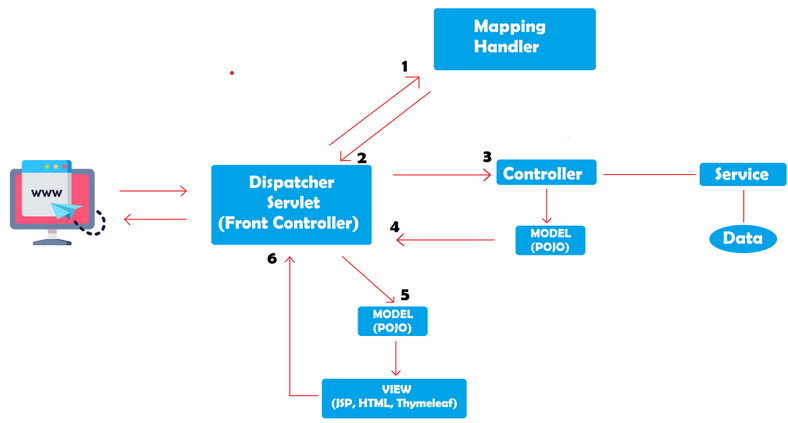

- The Model View Controller (MVC) design pattern specifies that an application consist of a data model, presentation information, and control information. 
- The pattern requires that each of these be separated into different objects.


- The Model contains only the pure application data, it contains no logic describing how to present the data to a user.
- The View presents the model’s data to the user. The view knows how to access the model’s data, but it does not know what this data means or what the user can do to manipulate it.
- The Controller exists between the view and the model. It listens to events triggered by the view (or another external source) and executes the appropriate reaction to these events. In most cases, the reaction is to call a method on the model. Since the view and the model are connected through a notification mechanism, the result of this action is then automatically reflected in the view.

## Advantages
- Multiple developers can work simultaneously on the model, controller and views.
- MVC enables logical grouping of related actions on a controller together. The views for a specific model are also grouped together.
- Models can have multiple views.


## Disadvantages
- The framework navigation can be complex because it introduces new layers of abstraction and requires users to adapt to the decomposition criteria of MVC.
- Knowledge on multiple technologies becomes the norm. Developers using MVC need to be skilled in multiple technologies.

## DAO and DTO objects

### DTO
- Data Transfer Objects. 
- It is used to transfer the data between classes and modules of your application.
These are generally used to transfer data from controller to client (JS). Term is also used for POCOs/POJOs by few which actually holds the data retrieved from Database.
- DTO should only contain private fields for your data, getters, setters, and constructors.
- DTO is not recommended to add business logic methods to such classes, but it is OK to add some util methods.

### DAO
- Data Access Objects.
- It should encapsulate the logic for retrieving, saving and updating data in your data storage (a database, a file-system, whatever). 
- Data Access Object is one of the design patterns used to implement DAL. This builds and executes queries on database and maps the result to POCO/POJO using various other patterns including 'Query Object', 'Data Mapper' etc. DAO layer could be further extended using 'Repository' pattern.

### DAL
- Data Access Layer 
- It abstracts your database activities using DAO/Repository/POCO etc. ORMs help you to build your DAL but it could be implemented without using them also.

```java
interface PersonDTO {
    String getName();
    void setName(String name);
    //.....
}

interface PersonDAO {
    PersonDTO findById(long id);
    void save(PersonDTO person);
    //.....
}
```

### POJO
- Plain Old Java Objects.
- A hand-wavy way of describing "normal" non-enterprise Java Objects.
- It's just a fancy name for a very basic class structure.
- POJO is not recommended to add business logic methods to such classes, but it is OK to add some util methods.


## Example 🔥
- To implement web application based on MVC design pattern.
    1. `Student` & `StudentService` Class [**Model Layer - Data Source Layer**]
    2. `StudentServlet` Class [**Controller Layer- Business Logic Layer**]
    3. `StudentRecord.jsp` [**View Layer - Presentation Layer**]


### Student Class
- `Student` Class contains the data of the student.

```java
public class Student {
    private int id;
    private String name;

    public void getId() {
        return id;
    }

    public void getName() {
        return name;
    }

    public String getJson() {
        return "{\"id\":\"" + id + "\",\"name\":\"" + name + "\"}";
    }
}
```

### StudentService Class
- `StudentService` Class manages the data management (access, modify, delete) of the student.

```java
public class StudentService {
    public Optional<Student> getStudent(int id) {
        switch (id) {
            case 1:
                return Optional.of(new Student(1, "Arjun"));
            case 2:
                return Optional.of(new Student(2, "Raju"));
            default:
                return Optional.empty();
        }
    }
}
```

### StudentServlet Class
- `StudentServlet` Class is the controller class which handles the request from the user and sends the response to the user.

```java
@WebServlet(name="StudentServlet", urlPatterns={"/student"})
public class StudentServlet extends HttpServlet {
    private StudentService studentService = new StudentService();
    
    @Override
    protected void doGet(HttpServletRequest request, HttpServletResponse response) throws ServletException, IOException {
        int id = Integer.parseInt(request.getParameter("id"));
        Optional<Student> student = studentService.getStudent(id);
        if (student.isPresent()) {
            response.setContentType("application/json");
            response.getWriter().write(student.getJson());
        } else {
            response.setStatus(HttpServletResponse.SC_NOT_FOUND);
        }
    }
}
```

### StudentRecord.jsp

- `StudentRecord.jsp` is the view component which displays the data to the user.
- JSP file has the HTML code which displays the data to the user.

```html
<!DOCTYPE html>
<html>
    <head>
        <title>Student Record</title>
    </head>
    <body>
    <% 
        if (request.getAttribute("student") != null) {
            Student student = (Student) request.getAttribute("studentRecord");
    %>
    <h1>Student Record</h1>
    <div>ID: <%= student.getId()%></div>
    <div>Name: <%= student.getName()%></div>
    <% 
        } else { 
    %>
    <h1>No student record found.</h1>
    <% } %>	
    </body>
</html>
```



## Question

> Demonstrate MVC architecture with the help of Servlet, JSP, POJO classes and JDBC.

We’ll create an Employee Registration module using JSP, Servlet, JDBC, and MySQL database.

### MYSQL Database Setup

Let's create a database named `employee` in MySQL. Let's create an employee table using below DDL script:

```sql

```

### Model Layer
Let's create the `Employee` class which will act as our Model class. This can be view as `POJO` (Plain Old Java Objects) class.

`# Employee.java`
```java

```

### DAO Layer
Let's create `EmployeeDAO` class that contains JDBC code to connect with the MySQL database. 

`# EmployeeDAO.java`
```java

```

### Controller Layer
Let's create an `EmployeeServlet` class to process HTTP request parameters and redirect to the appropriate JSP page after request data stored in the database:

`# EmployeeServlet.java`
```java

```
### View Layer
Let's design an employee registration HTML form with the following fields:

    - firstName
    - lastName

`# employeeRegister.jsp`
```html

```

After an employee successfully registered then this page show a successful message on screen:

`# employeeRegisterSuccess.jsp`
```html

```
